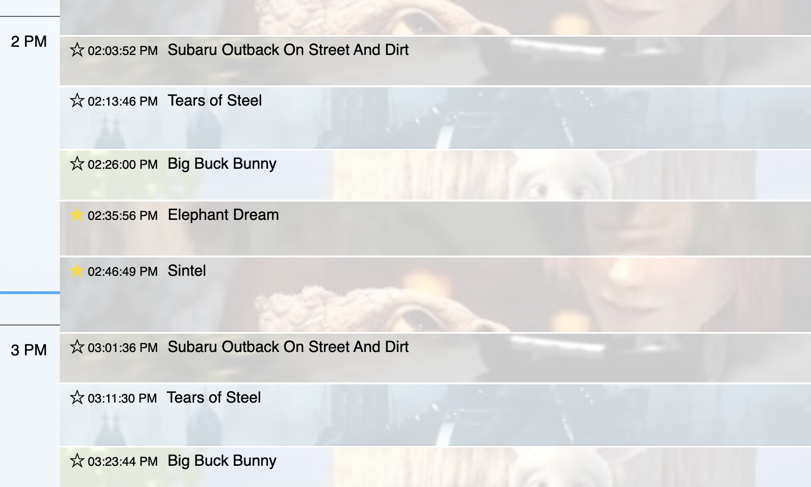

## My approaches

### Guide View

- We can display the guide view based on the data stored in [scheduleData](src/redux/selectors/schedule.js) stored in redux.
- I calculated the height of each video presentation based on the height of elements of the hours at the left side. [Ref](src/utils.js#L89)
```
calcHeightByDuration = duration_seconds / seconds_of_one_hour * height_one_hour
```
- For the favorites, I added a new state called [favorite](src/redux/reducers/favorite.js) to the redux.

### Live View

- For getting the current live video, I [filtered](src/redux/actions/player.js#L16) the scheduleData based on their startTime and endTime.
- For calcludating the start position of the video on loading, we can use the [startTime](src/components/player/player.tsx#L71) of the current video.
- We can get the [remaining](src/components/player/player.tsx#L43) time of the current video using ref of the video tag.
- We can use the index of the current video for getting [next video](src/components/player/player.tsx#L47) information.


## What I would do if given more time
- I have focues on the feature implementaion. I would like to spend more time on improving performance, optimizaiton if I have more time. I would like to clean up syntaxes, namings as well.